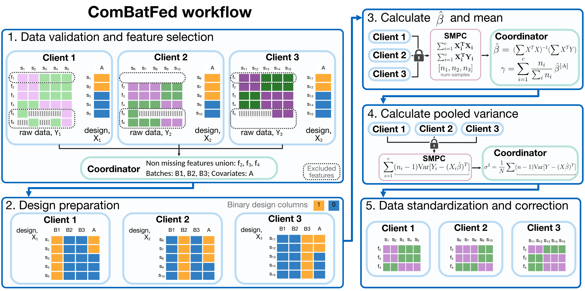
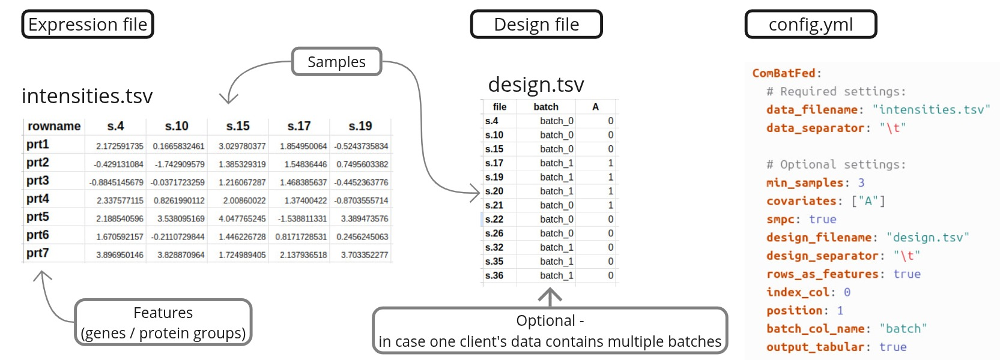

<table>
  <tr>
    <td><a href="https://freddsle.github.io/ComBatFed/combatfed/#usage"></a></td>
    <td><a href="https://freddsle.github.io/ComBatFed/"></a></td>
    <td><a href="https://github.com/Freddsle/ComBatFed/"></a></td>
    <td><a href="https://featurecloud.ai/app/combatfed"></a></td>
  </tr>
</table>

# Federated batch effects correction with ComBat (ComBatFed) <!-- omit in toc -->

[](https://opensource.org/licenses/Apache-2.0)
[](https://coveralls.io/github/Freddsle/ComBatFed?branch=main)

---

## Table of Contents  <!-- omit in toc -->

- [Architecture overview](#architecture-overview)
- [Glossary & further resources](#glossary--further-resources)
- [Installation](#installation)
  - [Prerequisites](#prerequisites)
  - [Clone the repository](#clone-the-repository)
- [Usage](#usage)
  - [Input and Output](#input-and-output)
  - [Configuration](#configuration)
  - [Quick start](#quick-start)
- [Contact information](#contact-information)
- [Troubleshooting](#troubleshooting)
- [License](#license)
- [How to cite](#how-to-cite)

---

## Overview


The **ComBatFed** is a federated implementation of the 'ComBat' method from the 'sva' R package, developed within the [FeatureCloud](https://featurecloud.ai/) platform. It enables privacy-preserving batch effect correction by keeping raw data decentralized and utilizing Secure Multiparty Computation (SMPC) for secure data aggregation.

ComBatFed allows multiple participants to collaboratively remove batch effects from their data without sharing raw data, ensuring privacy.  
You can access and use the `ComBatFed` app directly on [FeatureCloud](https://featurecloud.ai/app/combatfed). 


The repository contains the following components:
- **ComBatFed Implementation**: Located in the `combatfed` subfolder, providing the federated batch effect removal tool.
- **Evaluation**: Contains code and scripts to reproduce the analyses.


<p align="center">
   
   <br>
   <em>ComBatFed workflow </em>
</p>

For detailed usage instructions and implementation information, refer to the [README How To Guide](https://freddsle.github.io/ComBatFed/combatfed/).

---


## Glossary & further resources

- **FeatureCloud**: A platform enabling federated analyses. [FeatureCloud docs](https://featurecloud.ai/).
- **ComBat**: A method for batch effect correction from the [`sva` R package](https://bioconductor.org/packages/release/bioc/html/sva.html).
- **Federated Learning**: A machine learning approach that allows multiple parties to collaboratively train models without sharing raw data.
- **Coordinator**: The entity that initiates the federated learning process and coordinates the participants. Usually, one of the participants.
- **Participant/Client**: The entities that hold the data and participate in the federated learning process.

For more advanced configurations and detailed explanations, see the 
[configuration](https://freddsle.github.io/ComBatFed/combatfed/#configuration).

---

## Installation

### Prerequisites

Before installing `ComBatFed`, ensure you have the following installed:
1. **Docker**: [Installation Instructions](https://www.docker.com/get-started).
2. **FeatureCloud CLI**.
   For Windows users, git must also be installed and added to PATH. We recommend
   and tested using [WSL](https://docs.docker.com/desktop/features/wsl/).
3. **App Image** (either build locally or pull) - [info](https://freddsle.github.io/ComBatFed/combatfed/#prerequisites).

### Clone the repository

If you want to run the simulations locally, clone the repository:

```bash
git clone https://github.com/Freddsle/ComBatFed.git
cd ComBatFed
```

This will clone the repository to your local machine with example files and simulation scripts.

---

## Usage

### Input and Output

For files preparation, format, config file, and output details, refer to the [How To Guide](https://freddsle.github.io/ComBatFed/combatfed/#file-structure).

In summary, you need two main inputs and one optional file:

<p align="center">
   
   <br>
   <em>Input files required for ComBatFed.</em>
</p>

Output files include:
- **Corrected Data**: The batch-corrected data, provided in the same format as the input file or as specified in the configuration file.
- **Log File**: A detailed log of the processing steps and any warnings or errors encountered.


### Configuration

`ComBatFed` is highly configurable via the `config.yml` file. This file controls data formats, normalization methods, and other essential parameters.

Example Config File (config.yml):

```yaml
ComBatFed:
  # Required settings:
  data_filename: "expr_for_correction.tsv"      # Data file relative to the input folder
  data_separator: "\t"                          # CSV file delimiter

  # Optional settings:
  min_samples: 3                                
  covariates: ["Status"]                       
  smpc: true                                    
  design_filename: "design.tsv"                 
  design_separator: "\t"                        
  rows_as_features: false                       
  index_col: 0                                 
  position: 1                                   
  batch_col_name: "batch"                       
  output_tabular: true                         

```
_For a comprehensive list of configuration options, refer to the [Configuration Section](https://freddsle.github.io/ComBatFed/combatfed/#configuration) in the combatfed README._


### Quick start

1. For a step-by-step detailed instructions on how to start collaboration using multiple machines, refer to the [How To Guide](https://freddsle.github.io/ComBatFed/combatfed/#quick-start---test-mode).
2. For a step-by-step instructions on how to simulate collaboration via test environment, refer to the [Local Test Guide](https://freddsle.github.io/ComBatFed/combatfed/#quick-start---collaboration-mode).

---

## Contact information

For questions, issues, or support, please open an issue on the [GitHub repository](https://github.com/Freddsle/ComBatFed).

---

## Troubleshooting

Encountering issues? Here are some common problems and their solutions:

- **Missing Files**: Ensure `config.yml` and data files are in the correct directory.
- **Incorrect Format**: Verify `rows_as_features` and `index_col` settings in `config.yml`.
- **No Output Produced**: Check logs for error messages.
- **Errors with Test runs**: Ensure the is no leftover running Docker containers. Restart Docker / System if necessary. 

---

## License

This project is licensed under the [Apache License 2.0](LICENSE).

---

## How to cite

If you use this code in your research, please cite the repository
```bibtex
@misc{ComBatFed,
  author = {Yuliya Burankova},
  title = {ComBatFed: Federated batch effects correction with ComBat},
  year = {2025},
  publisher = {GitHub},
  journal = {GitHub repository},
  url = {https://github.com/Freddsle/ComBatFed}
}
```